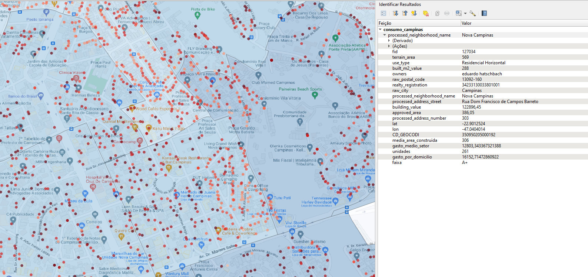

## Consumption projection with Python and Qgis

## Table of Contents

- [Project Description](#project-description)
- [Data](#data)
- [Methods](#methods)
- [Tools and Technologies](#tools-and-technologies)
- [Results](#results)
- [References](#references)

### Project Description:

In this project, we will be analyzing and building a graphical representation of the consumption of regions and properties in the city of Campinas Brazil.

### Data:

The expense data comes from the Consumer Price Index (IPC), with the file name 'prediction-expense-by-census-tract'. The census tracts come from IBGE, with the shapefiles named '35SEE250GC_SIR'. Finally, we have the data for the Property Tax Information Return (IPTU) for the city of Campinas.

### Methods:

In a nutshell, we will be cross-referencing data between the IPC dataset and the IBGE dataset, and finally, we will cross-reference this information with the IPTU data. The steps are described in the notebook.

### Tools and Technologies:

This project was developed using the following tools and technologies:
- Python : A programming language used for data analysis and machine learning.
- Pandas: A popular data manipulation and analysis library.
- GeoPandas: A Python library used to work with geospatial data.
- Regular Expressions (RegEx): A sequence of characters used to match patterns in text data.
- QGIS: A free and open-source desktop GIS (Geographic Information System) software.

#### Installing QGIS

QGIS is a free and open-source geographic information system that allows you to view, edit, and analyze geospatial data. To install QGIS, follow these steps:

- Go to the QGIS download page at https://www.qgis.org/en/site/forusers/download.html.
- Select your operating system from the options provided.
- Follow the on-screen instructions to download and install QGIS.

### Results:
As we can see in the "qgis" folder, there is a robust consumption projection for the city of Campinas. This can be very useful, depending on the purpose. We have the areas and properties classified by expenditure, represented by blue and red, respectively.

### References:

- https://www.ibge.gov.br/estatisticas/economicas/precos-e-custos/9256-indice-nacional-de-precos-ao-consumidor-amplo.html?=&t=destaques
- https://www.ibge.gov.br/geociencias/organizacao-do-territorio/malhas-territoriais/26565-malhas-de-setores-censitarios-divisoes-intramunicipais.html?=&t=downloads
